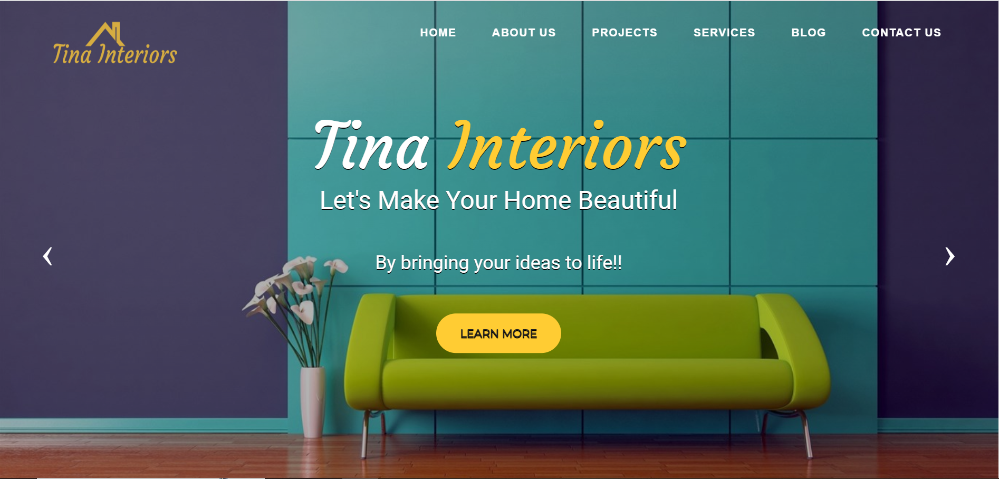

# Project - Interior Design Website

This is an Interior Design Website project, an aesthetically pleasing personal website project based on a fictional Interior Design company.

## Table of contents

- [Overview](#overview)
  - [The functionality](#the-functionality)
  - [Screenshot](#screenshot)
- [My process](#my-process)
  - [Built with](#built-with)
  - [Continued development](#continued-development)
- [Author](#author)

## Overview

### The functionality

Users should be able to:

- Easily access and navigate within the dynamic interface of the website.
- View the optimal layout for the site depending on their device's screen size (Responsive).
- See hover states for all interactive elements and jump to each section of the navigation bar on the one-page website.

### Screenshot

## My process

### Built with

  - Semantic HTML5 markup
  - CSS custom properties
  - CSS Framework

### Continued development

I will continue to develop myself on building responsive websites and master them eventually.

## Author

- Miss Florentina Nkoyo
